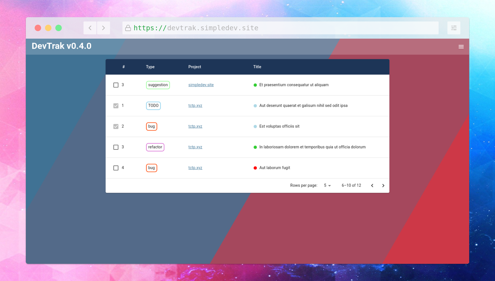

# DevTrack (still in early development)

DevTrak is a simple issue/progress tracker built in React with
[Material UI](https://mui.com/).
It was originally built for tracking the bugs and progress for my own personal
projects but the backend database should (eventually) be robust enough to be
scaled for larger projects.

## Features (Work-In-Progress):
* Slick, accessible and responsive [Material UI](https://mui.com/) interface
* Flat issue tree to allow access to all issues at once
* Simple token-based [auth0](https://auth0.com/) authentication
* MongoDB JSON database in the backend to manage and store the data